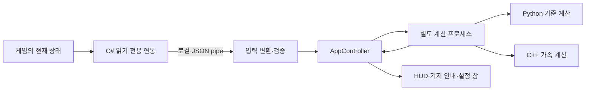

# 구조와 코드 읽기 안내

Python 3.13/PySide6 UI, 읽기 전용 BepInEx C# 연동, C++ 계산 DLL로 구성됩니다.
사용자가 직접 게임을 조작하고, 도우미는 상태를 읽어 제안합니다.

## 먼저 읽을 흐름

| 질문 | 시작 파일 | 다음 파일 |
|---|---|---|
| 앱은 어떻게 시작·종료하나? | `main.py` | `src/services/app_runtime.py`, `src/app_controller.py` |
| 게임의 어떤 정보를 읽나? | `tools/bepinex/BallxPitBridge/Plugin.cs` | `PhysicsSnapshot.cs`, `EffectiveProperties.cs` |
| 잘못되거나 누락된 입력은 어떻게 처리하나? | `src/tracking/bridge_adapter.py` | `meta_state.py`, `game_contract.py` |
| 현재 전투 선택지를 왜 추천하나? | `src/engine/recommender.py` | `current_effects.py`, `roadmap.py`, `discovery.py` |
| 발사·반사·채집 순서는 어떻게 계산하나? | `src/engine/harvest_sim.py` | `world_tasks.py`, `native.py`, `native/bxp_native.cpp` |
| 건물 범위·배치는 어떻게 비교하나? | `src/engine/game_range.py` | `layout_opt.py`, `layout_guide.py`, `resource_access.py` |
| 오래된 결과가 다시 뜨는 것을 어떻게 막나? | `src/engine/sim_signature.py` | `src/services/sim_worker.py`, `src/engine/sim_jobs.py` |
| 추정과 실제 관측을 어떻게 대조하나? | `src/tracking/harvest_contract.py` | `tests/test_game_*`, `docs/reference/GAME_DATA_CONTRACT.ko.md` |
| 배포물·라이선스는 어디서 구성하나? | `BallxPitCompanion.spec` | `tools/package_notices.py`, `tools/package_sources.py` |

시작 파일은 저장소 루트 기준이며, 경로가 생략된 다음 파일은 같은 폴더에 있습니다.

## 세 가지 자료를 구분하기

1. **관측값:** 게임이 보낸 현재 위치·재고·효과·범위 포함 판정입니다. 다른 순간이나 다른 배치에 그대로 쓰면 안 됩니다.
2. **예측값:** 관측을 입력으로 계산한 미래 궤적·수확량·이동 후보입니다. 누락된 조건과 근사가 있습니다.
3. **정책/평가:** 커뮤니티 의견, 자원 선호 가중치, 이동 수 최소화 등 추천의 우선순위입니다. 게임 수식이 아닙니다.

`game_contract.validate_ranges`는 관측 ID 목록을 독립적인 수식 결과와 비교합니다.
`game_range.row_in_range`는 현재 위치가 같을 때 관측을 우선하는 일반 계산 함수입니다.
검증 함수가 후자를 부르면 같은 관측을 자기 자신과 비교하게 되므로 두 경로를 합치지 않습니다.

## 단위와 자료 형식

- 자원 배열의 순서: `[골드, 밀, 나무, 돌]`.
- 게임 건물 레벨은 일반적으로 0부터, UI의 표시 레벨은 1부터 시작합니다. 카드 `effective.level`은 표시 레벨입니다.
- 기지 물리 좌표는 게임 월드 좌표이며 y축이 위로 향합니다. 화면 좌표는 게임 창 기준 픽셀로 y축이 아래로 향합니다.
- `Worker.t`와 경로의 세 번째 값은 발사 시작을 기준으로 한 게임 시간입니다. 팀의 뒤 작업자는 시작 시간이 늦습니다.
- `TaskClock`은 별도의 세계 시계를 게임 시간으로 환산합니다. 자동 생산 수입은 작업자 수확량과 따로 둡니다.
- `range_boxes`는 대상 건물 중심에 상대적인 영역입니다. `observed_pose`와 다른 후보에는 관측 당시 포함 목록을 쓰지 않습니다.
- C++ 배열 순서와 `ABI`는 Python 래퍼와 계약입니다. 원소 추가·순서 변경 시 양쪽 수정과 DLL 재빌드가 필요합니다.

## 수정할 때 보존할 것

- 무거운 계산은 `SimWorker` 프로세스에서 실행합니다. UI 콜백에서 직접 탐색하지 않습니다.
- 계산 입력은 사본으로 다룹니다. 시뮬레이션의 재고 변화가 실제 스냅샷을 덮어쓰면 안 됩니다.
- 누락된 벽·실패한 범위 판정은 ‘빈 공간’ 또는 ‘범위 안’으로 바꾸지 않습니다.
- 같은 입력에서 Python/C++가 같은 결과를 내는지와, 그 결과가 게임 규칙에 맞는지는 서로 다른 검사입니다.
- 테스트 통과, 패키지 실행, 실제 게임 수신, 실제 발사 일치는 별도로 기록합니다.

구체적인 미지원 효과와 실측 한계는 [게임 정보 대조 문서](reference/GAME_DATA_CONTRACT.ko.md)를 확인하세요.
